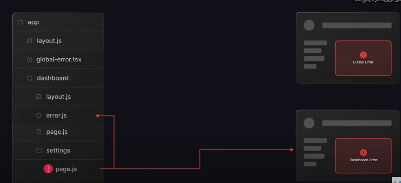
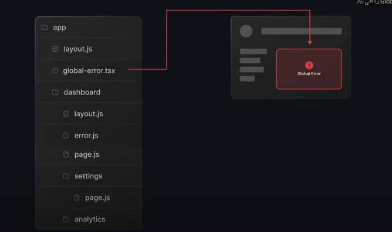

# 🚀 **Next.js 15 Tutorial**

## 📌 **ساختار روت‌بندی (Routing Structure)**

در Next.js 15، **ساختار صفحات** به‌صورت پوشه‌بندی انجام می‌شود. در ادامه ساختار مسیرها را توضیح داده‌ایم:

### **🔹 صفحات استاتیک (Static Routes)**

| فایل                                           | مسیر (URL)             | توضیحات               |
| ---------------------------------------------- | ---------------------- | --------------------- |
| `page.jsx`                                     | `/`                    | صفحه اصلی (Home Page) |
| `folder(about)/page.jsx`                       | `/about`               | صفحه درباره ما        |
| `folder(dashboard)/folder(users)/page.jsx`     | `/dashboard/users`     | صفحه کاربران          |
| `folder(dashboard)/folder(analytics)/page.jsx` | `/dashboard/analytics` | صفحه آنالیز           |

---

### **🔹 روت‌بندی داینامیک (Dynamic Routing)**


اگر بخواهید **آی‌دی هر کاربر** را در مسیر مشخص کنید، باید از **براکت `[ ]`** استفاده کنید:

#### 📌 مثال:

برای نمایش جزئیات کاربران در مسیرهای زیر:

```
/dashboard/users/user-1
/dashboard/users/user-2
/dashboard/users/user-3
```

باید مسیر داینامیک را به این شکل تعریف کنید:

```bash
folder(dashboard)/folder(users)/folder([id])/page.jsx
```

> **این پوشه مشخص می‌کند که هر `id` داینامیک است و مقدار آن تغییر می‌کند.**

---

اینجا یه نسخه مرتب‌تر و خواناتر از متن شما با **ساختار بهتر برای نمایش تصاویر** در README:

---

# 🔥 **کد نمونه برای صفحه داینامیک کاربر**

```tsx
const UserItem = ({ params }: { params: { id: string } }) => {
  const { id } = params;

  return (
    <div>
      <h1>User Profile: {id}</h1>
    </div>
  );
};

export default UserItem;
```

✅ در این کد، وقتی کاربر وارد مسیر **`/dashboard/users/[id]`** شود، مقدار `id` نمایش داده خواهد شد.

---

# 🎨 **لایه‌بندی (Layout)**

در این بخش، لایه‌بندی پروژه را مشاهده می‌کنید:
میایم پروژه رو برای کد نویسی ساختار بهش میدیم ولی این ساختار توی url سایت نمیاد.

<div align="center">
  <table>
    <tr>
      <td align="center"></td>
      <td align="center"></td>
      <td align="center"></td>
      <td align="center"></td>
    </tr>
  </table>
</div>
---

children تمامی کامپوننت ها و پیج های توی فولدره dashboard هست.(users,analytics)


این ساختار مربوط به **Next.js** است و از قابلیت **Route Groups (گروه‌بندی مسیرها)** در **App Router** (که از نسخه 13 به بعد معرفی شده) استفاده می‌کند.

### توضیح ساختار:

**(dashboard)** و **(root)** داخل پرانتز قرار دارند.

- این یعنی این پوشه‌ها مسیرهای گروه‌بندی شده هستند و **خودشان روی مسیر URL تأثیر ندارند**.
- مثلاً اگر `app/(dashboard)/dashboard/analytics` را داشته باشیم، مسیر URL نهایی **/dashboard/analytics** خواهد بود و `(dashboard)` تأثیری روی آن ندارد.

**layout.tsx در (dashboard) و (root)**

- فایل `layout.tsx` در هر گروه برای تعیین یک **طرح کلی (layout) برای مسیرهای داخل آن گروه** استفاده می‌شود.
- مثلاً `layout.tsx` در `(dashboard)` روی همه مسیرهای داخل این گروه اعمال می‌شود.

**صفحات داخلی (`page.tsx`)**

- فایل `page.tsx` یک صفحه را نمایش می‌دهد.
- در `(root)/page.tsx` احتمالاً صفحه اصلی (`/`) را نشان می‌دهد.

**گروه‌بندی مسیرها**

- مسیرهای مختلف را می‌توان در گروه‌های جدا دسته‌بندی کرد. این کار باعث می‌شود **layout** جدا برای هر گروه داشته باشیم.

### مثال مسیرها:

| پوشه و فایل                                | مسیر URL نهایی         |
| ------------------------------------------ | ---------------------- |
| `(dashboard)/dashboard/analytics/page.tsx` | `/dashboard/analytics` |
| `(dashboard)/dashboard/users/page.tsx`     | `/dashboard/users`     |
| `(root)/about/page.tsx`                    | `/about`               |


### مزایای استفاده از گروه‌بندی مسیرها:

✔ **کاهش پیچیدگی مسیرها**  
✔ **امکان داشتن چند Layout جداگانه برای بخش‌های مختلف**  
✔ **سازماندهی بهتر پروژه**

# 🚀 مدیریت خطا در Next.js با `error.tsx`

در **Next.js 13+** (با **App Router**)، فایل **`error.tsx`** برای مدیریت خطاهای هر مسیر استفاده می‌شود. این فایل مانند **Error Boundary در React** عمل می‌کند و یک UI مناسب برای خطاها نمایش می‌دهد.

## 📌 ویژگی‌های `error.tsx`

✅ اجرای **خودکار** هنگام بروز خطا در یک صفحه خاص  
✅ امکان **ریست کردن خطاها** با `reset()`  
✅ تعریف **جداگانه** برای هر `page.tsx` یا `layout.tsx`

## 🛠 نحوه استفاده

`error.tsx` را در کنار **`page.tsx` یا `layout.tsx`** هر مسیر قرار دهید.

### ✨ مثال:

```tsx
"use client";
import { useEffect } from "react";

export default function Error({
  error,
  reset,
}: {
  error: Error;
  reset: () => void;
}) {
  useEffect(() => console.error("خطا:", error), [error]);

  return (
    <div>
      <h2>مشکلی پیش آمده! 🚨</h2>
      <p>{error.message}</p>
      <button onClick={reset}>تلاش مجدد</button>
    </div>
  );
}
```

## 📂 ساختار پوشه‌ها

```
app/
 ├── dashboard/
 │   ├── page.tsx
 │   ├── error.tsx  <-- مدیریت خطاهای مسیر "dashboard"
 │   └── layout.tsx
 ├── page.tsx
 ├── layout.tsx
```

`error.tsx` در **هر مسیر** فقط روی همان صفحه اعمال می‌شود.

## 🚀 نتیجه‌گیری

**`error.tsx`** مدیریت خطا را آسان‌تر کرده و تجربه کاربری را بهبود می‌بخشد. با **`reset()`** می‌توان خطاها را ریست کرد و بدون نیاز به رفرش، صفحه را بازیابی کرد.

````markdown
# 🚨 Error Handling و Loading Components در **Next.js 13+**

## ⚠️ **Error Handling**

در زمان وقوع خطا، به جای اینکه کاربر تصور کند کل سایت دچار مشکل شده، باید یک **پیام خطای واضح و شفاف** نمایش داده شود تا او بداند که فقط یک مشکل کوچیک پیش آمده. این روش به کاربران احساس امنیت می‌دهد و باعث می‌شود که تجربه کاربری بهتری داشته باشند.

### 📸 **نمونه تصاویر نمایش خطا:**




---

## ⏳ **Loading Components در Next.js 13+**

در **Next.js 13+** که از **App Router** استفاده می‌کند، فایل **`loading.tsx`** برای نمایش یک **حالت بارگذاری** استفاده می‌شود. این فایل زمانی که صفحه در حال بارگذاری است، به کاربر نمایش داده می‌شود.

### 📌 **چرا `loading.tsx` مهم است؟**

زمانی که داده‌ها از سرور یا منابع خارجی بارگذاری می‌شوند، ممکن است صفحه برای مدت کوتاهی خالی باشد. به جای اینکه کاربر صفحه خالی یا بی‌اطلاعی ببیند، می‌توانیم یک **نمایش بارگذاری** (مثل چرخ‌دنده یا نوار پیشرفت) نمایش دهیم تا به او نشان دهیم که صفحه در حال لود است.

### 🔧 **چطور کار می‌کند؟**

- فایل **`loading.tsx`** باید در کنار **`page.tsx`** یا **`layout.tsx`** قرار گیرد.
- هنگام بارگذاری صفحه، **`loading.tsx`** نمایش داده می‌شود.
- این فایل به‌طور جداگانه برای هر صفحه یا **layout** قابل استفاده است.

### ✨ **مثال از `loading.tsx`**

```tsx
// loading.tsx
export default function Loading() {
  return (
    <div style={{ textAlign: "center", padding: "50px" }}>
      <h2>در حال بارگذاری...</h2>
      <div className="spinner"></div>
      <style jsx>{`
        .spinner {
          margin: 20px auto;
          border: 4px solid rgba(255, 255, 255, 0.3);
          border-top: 4px solid #0070f3;
          border-radius: 50%;
          width: 40px;
          height: 40px;
          animation: spin 1s linear infinite;
        }
        @keyframes spin {
          0% {
            transform: rotate(0deg);
          }
          100% {
            transform: rotate(360deg);
          }
        }
      `}</style>
    </div>
  );
}
```
````

### 📂 **ساختار پوشه‌ها**

```
app/
 ├── dashboard/
 │   ├── page.tsx
 │   ├── loading.tsx  <-- نمایش لودینگ برای صفحه "dashboard"
 │   └── layout.tsx
 ├── page.tsx
 ├── layout.tsx
```

### ✅ **نتیجه‌گیری**

فایل **`loading.tsx`** به شما این امکان را می‌دهد که در زمان بارگذاری داده‌ها، یک حالت **بارگذاری** شفاف و کاربرپسند به کاربر نمایش دهید. این روش تجربه کاربری بهتری فراهم می‌کند و به کاربر نشان می‌دهد که صفحه در حال بارگذاری است.

````

### 🚀 **تفاوت Server Component و Client Component در Next.js**


#### ✅ **Server Component (کامپوننت سمت سرور)**
🔹 **پیش‌فرض در Next.js 13+** (با App Router)
🔹 روی **سرور رندر** می‌شود → کد در مرورگر ارسال نمی‌شود
🔹 مناسب برای:
  - واکشی داده‌ها (`fetch`)
  - سئو بهتر
  - عملکرد سریع‌تر
🔹 **مثال:**
```tsx
export default async function ServerComponent() {
  const data = await fetch("https://api.example.com/data").then((res) => res.json());
  return <div>{data.title}</div>;
}
````

---

#### ✅ **Client Component (کامپوننت سمت کلاینت)**

🔹 باید `use client` بالای فایل اضافه شود  
🔹 روی **مرورگر اجرا** می‌شود  
🔹 مناسب برای:

- **استیت (useState, useEffect)**
- **رویدادها (onClick, onChange)**  
  🔹 **مثال:**

```tsx
"use client";
import { useState } from "react";

export default function ClientComponent() {
  const [count, setCount] = useState(0);
  return <button onClick={() => setCount(count + 1)}>Count: {count}</button>;
}
```

---

### 🏆 **نتیجه‌گیری**

✔ **Server Component** برای **واکنش داده و سئو** بهتر است.  
✔ **Client Component** برای **استیت و تعاملات کاربر** استفاده می‌شود.  
✔ می‌توان **هردو را ترکیب کرد** (مثلاً داده در سرور و تعاملات در کلاینت). 🚀


## **📌 مدیریت بک‌اند در Next.js**  

Next.js امکان مدیریت بک‌اند را بدون نیاز به سرور جداگانه فراهم می‌کند. در این راهنما روش‌های مختلف پیاده‌سازی بک‌اند در Next.js را بررسی می‌کنیم.  

---

### **📖 فهرست مطالب**  
 [API Routes (مسیرهای API)](#-api-routes-مسیرهای-api)  
 [اتصال به پایگاه داده](#-اتصال-به-پایگاه-داده)  
 [Middleware در Next.js](#-middleware-در-nextjs)  
 [استفاده از سرورهای خارجی (Serverless Functions)](#-استفاده-از-سرورهای-خارجی-serverless-functions)  
 [سرور سفارشی با Express.js](#-اجرای-بکاند-به-روش-فول-استک-custom-server)  
 [جمع‌بندی](#-جمعبندی)  

---

## **🚀 1. API Routes (مسیرهای API)**  
Next.js به شما اجازه می‌دهد **API‌های سرورلس** را در مسیر `/pages/api` ایجاد کنید.  

📌 **مثال یک API ساده:**  
فایل `pages/api/hello.js`:  
```javascript
export default function handler(req, res) {
  res.status(200).json({ message: 'سلام از بک‌اند Next.js!' });
}
```
✅ این API در مسیر `/api/hello` پاسخ **JSON** برمی‌گرداند.  

---

## **🔗 2. اتصال به پایگاه داده**  
شما می‌توانید در API Routes به دیتابیس‌هایی مثل **MongoDB، PostgreSQL یا MySQL** متصل شوید.  

📌 **مثال اتصال به MongoDB:**  
**1️⃣ نصب MongoDB Client:**  
```bash
npm install mongodb
```
**2️⃣ ایجاد API برای دریافت کاربران:**  
فایل `pages/api/users.js`:  
```javascript
import { MongoClient } from 'mongodb';

const uri = process.env.MONGO_URI; // مقدار متغیر محیطی

export default async function handler(req, res) {
  const client = new MongoClient(uri);
  await client.connect();
  const db = client.db("myDatabase");
  const users = await db.collection("users").find().toArray();
  client.close();

  res.status(200).json(users);
}
```
✅ این API لیست کاربران را از **MongoDB** دریافت و نمایش می‌دهد.  

---

## **🛡 3. Middleware در Next.js**  
Middleware به شما امکان کنترل درخواست‌ها را قبل از رسیدن به API Routes یا صفحات می‌دهد.  

📌 **مثال Middleware برای احراز هویت:**  
فایل `middleware.js`:  
```javascript
import { NextResponse } from 'next/server';

export function middleware(req) {
  const token = req.cookies.get('token');
  if (!token) {
    return NextResponse.redirect('/login');
  }
  return NextResponse.next();
}

export const config = {
  matcher: ['/dashboard/:path*'], // فقط روی مسیرهای داخل /dashboard اجرا می‌شود
};
```
✅ اگر کاربر لاگین نکرده باشد، به **صفحه لاگین** هدایت می‌شود.  

---

## **☁ 4. استفاده از سرورهای خارجی (Serverless Functions)**  
اگر از **Vercel** برای دیپلوی Next.js استفاده می‌کنید، تمام API Routes به‌صورت **سرورلس فانکشن** اجرا می‌شوند و به سرور جداگانه نیاز ندارید.  

---

## **💻 5. اجرای بک‌اند به روش فول استک (Custom Server)**  
اگر نیاز به کنترل بیشتر دارید، می‌توانید **یک سرور Express.js** برای مدیریت API و صفحات Next.js راه‌اندازی کنید.  

📌 **مثال استفاده از Express.js:**  
**1️⃣ نصب Express:**  
```bash
npm install express
```
**2️⃣ ایجاد فایل `server.js`:**  
```javascript
const express = require('express');
const next = require('next');

const app = next({ dev: process.env.NODE_ENV !== 'production' });
const handle = app.getRequestHandler();

app.prepare().then(() => {
  const server = express();

  server.get('/api/hello', (req, res) => {
    res.json({ message: 'سلام از سرور Express!' });
  });

  server.all('*', (req, res) => {
    return handle(req, res);
  });

  server.listen(3000, () => {
    console.log('Server running on http://localhost:3000');
  });
});
```
✅ این سرور **Express.js** را با Next.js ترکیب می‌کند.  

---

## **📌 جمع‌بندی**  
🔹 **API Routes** → ساده‌ترین روش برای ایجاد API‌های بک‌اند  
🔹 **اتصال به پایگاه داده** → پشتیبانی از **MongoDB، PostgreSQL، MySQL و ...**  
🔹 **Middleware** → کنترل درخواست‌ها و امنیت  
🔹 **Serverless Functions** → برای اجرا در **Vercel**  
🔹 **Custom Server** → برای استفاده از **Express.js** یا سایر فریمورک‌های بک‌اند  

🚀 بسته به نیاز پروژه، یکی از روش‌های بالا را انتخاب کنید.