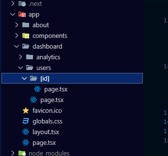
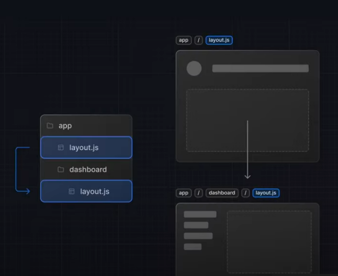
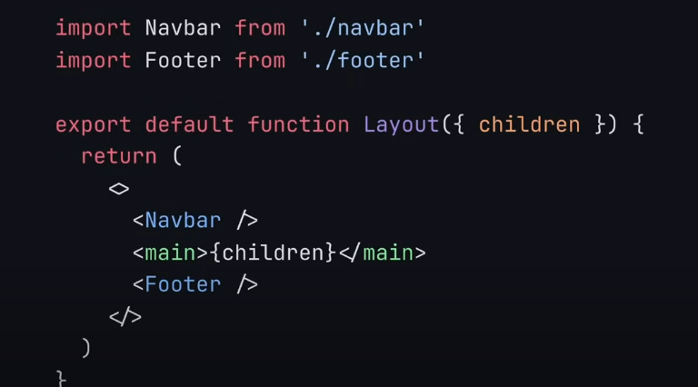
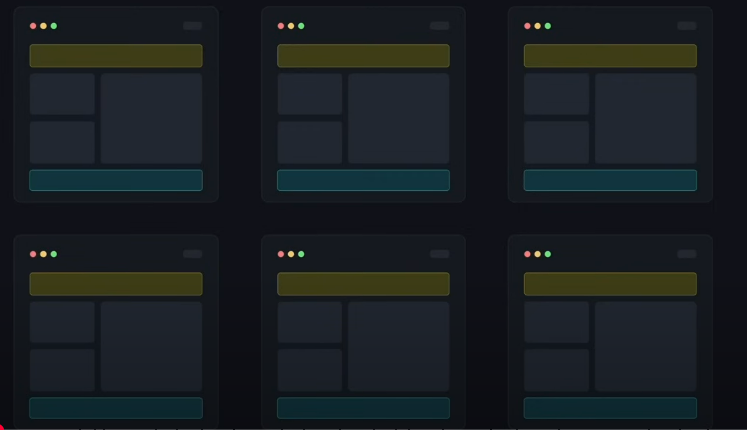
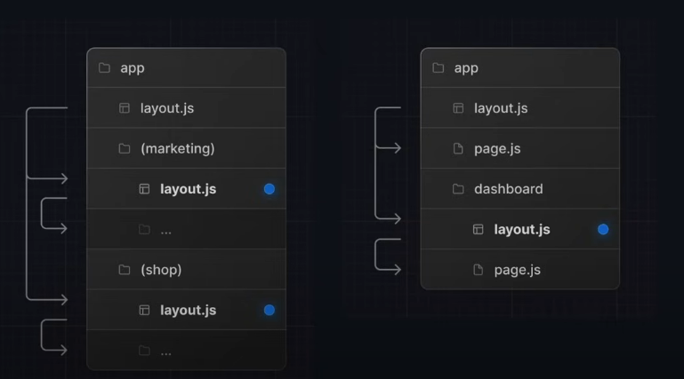
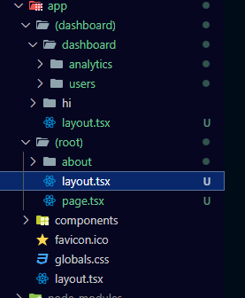

# 🚀 **Next.js 15 Tutorial**

## 📌 **ساختار روت‌بندی (Routing Structure)**

در Next.js 15، **ساختار صفحات** به‌صورت پوشه‌بندی انجام می‌شود. در ادامه ساختار مسیرها را توضیح داده‌ایم:

### **🔹 صفحات استاتیک (Static Routes)**

| فایل                                           | مسیر (URL)             | توضیحات               |
| ---------------------------------------------- | ---------------------- | --------------------- |
| `page.jsx`                                     | `/`                    | صفحه اصلی (Home Page) |
| `folder(about)/page.jsx`                       | `/about`               | صفحه درباره ما        |
| `folder(dashboard)/folder(users)/page.jsx`     | `/dashboard/users`     | صفحه کاربران          |
| `folder(dashboard)/folder(analytics)/page.jsx` | `/dashboard/analytics` | صفحه آنالیز           |

---

### **🔹 روت‌بندی داینامیک (Dynamic Routing)**



اگر بخواهید **آی‌دی هر کاربر** را در مسیر مشخص کنید، باید از **براکت `[ ]`** استفاده کنید:

#### 📌 مثال:

برای نمایش جزئیات کاربران در مسیرهای زیر:

```
/dashboard/users/user-1
/dashboard/users/user-2
/dashboard/users/user-3
```

باید مسیر داینامیک را به این شکل تعریف کنید:

```bash
folder(dashboard)/folder(users)/folder([id])/page.jsx
```

> **این پوشه مشخص می‌کند که هر `id` داینامیک است و مقدار آن تغییر می‌کند.**

---

اینجا یه نسخه مرتب‌تر و خواناتر از متن شما با **ساختار بهتر برای نمایش تصاویر** در README:

---

# 🔥 **کد نمونه برای صفحه داینامیک کاربر**

```tsx
const UserItem = ({ params }: { params: { id: string } }) => {
  const { id } = params;

  return (
    <div>
      <h1>User Profile: {id}</h1>
    </div>
  );
};

export default UserItem;
```

✅ در این کد، وقتی کاربر وارد مسیر **`/dashboard/users/[id]`** شود، مقدار `id` نمایش داده خواهد شد.

---

# 🎨 **لایه‌بندی (Layout)**

در این بخش، لایه‌بندی پروژه را مشاهده می‌کنید:
میایم پروژه رو برای کد نویسی ساختار بهش میدیم ولی این ساختار توی url سایت نمیاد.

<div align="center">
  <table>
    <tr>
      <td align="center"></td>
      <td align="center"></td>
      <td align="center"></td>
      <td align="center"></td>
    </tr>
  </table>
</div>
---

children تمامی کامپوننت ها و پیج های توی فولدره dashboard هست.(users,analytics)


 این ساختار مربوط به **Next.js** است و از قابلیت **Route Groups (گروه‌بندی مسیرها)** در **App Router** (که از نسخه 13 به بعد معرفی شده) استفاده می‌کند.

### توضیح ساختار:
 **(dashboard)** و **(root)** داخل پرانتز قرار دارند.  
   - این یعنی این پوشه‌ها مسیرهای گروه‌بندی شده هستند و **خودشان روی مسیر URL تأثیر ندارند**.
   - مثلاً اگر `app/(dashboard)/dashboard/analytics` را داشته باشیم، مسیر URL نهایی **/dashboard/analytics** خواهد بود و `(dashboard)` تأثیری روی آن ندارد.
   
 **layout.tsx در (dashboard) و (root)**  
   - فایل `layout.tsx` در هر گروه برای تعیین یک **طرح کلی (layout) برای مسیرهای داخل آن گروه** استفاده می‌شود.
   - مثلاً `layout.tsx` در `(dashboard)` روی همه مسیرهای داخل این گروه اعمال می‌شود.

 **صفحات داخلی (`page.tsx`)**  
   - فایل `page.tsx` یک صفحه را نمایش می‌دهد.
   - در `(root)/page.tsx` احتمالاً صفحه اصلی (`/`) را نشان می‌دهد.

 **گروه‌بندی مسیرها**  
   - مسیرهای مختلف را می‌توان در گروه‌های جدا دسته‌بندی کرد. این کار باعث می‌شود **layout** جدا برای هر گروه داشته باشیم.

### مثال مسیرها:
| پوشه و فایل | مسیر URL نهایی |
|-------------|---------------|
| `(dashboard)/dashboard/analytics/page.tsx` | `/dashboard/analytics` |
| `(dashboard)/dashboard/users/page.tsx` | `/dashboard/users` |
| `(root)/about/page.tsx` | `/about` |



### مزایای استفاده از گروه‌بندی مسیرها:
✔ **کاهش پیچیدگی مسیرها**  
✔ **امکان داشتن چند Layout جداگانه برای بخش‌های مختلف**  
✔ **سازماندهی بهتر پروژه**  


# 🚀 مدیریت خطا در Next.js با `error.tsx`  

در **Next.js 13+** (با **App Router**)، فایل **`error.tsx`** برای مدیریت خطاهای هر مسیر استفاده می‌شود. این فایل مانند **Error Boundary در React** عمل می‌کند و یک UI مناسب برای خطاها نمایش می‌دهد.  

## 📌 ویژگی‌های `error.tsx`  
✅ اجرای **خودکار** هنگام بروز خطا در یک صفحه خاص  
✅ امکان **ریست کردن خطاها** با `reset()`  
✅ تعریف **جداگانه** برای هر `page.tsx` یا `layout.tsx`  

## 🛠 نحوه استفاده  
`error.tsx` را در کنار **`page.tsx` یا `layout.tsx`** هر مسیر قرار دهید.  

### ✨ مثال:  
```tsx
"use client";  
import { useEffect } from "react";

export default function Error({ error, reset }: { error: Error; reset: () => void }) {
  useEffect(() => console.error("خطا:", error), [error]);

  return (
    <div>
      <h2>مشکلی پیش آمده! 🚨</h2>
      <p>{error.message}</p>
      <button onClick={reset}>تلاش مجدد</button>
    </div>
  );
}
```

## 📂 ساختار پوشه‌ها  
```
app/
 ├── dashboard/
 │   ├── page.tsx
 │   ├── error.tsx  <-- مدیریت خطاهای مسیر "dashboard"
 │   └── layout.tsx
 ├── page.tsx
 ├── layout.tsx
```
`error.tsx` در **هر مسیر** فقط روی همان صفحه اعمال می‌شود.  

## 🚀 نتیجه‌گیری  
**`error.tsx`** مدیریت خطا را آسان‌تر کرده و تجربه کاربری را بهبود می‌بخشد. با **`reset()`** می‌توان خطاها را ریست کرد و بدون نیاز به رفرش، صفحه را بازیابی کرد.